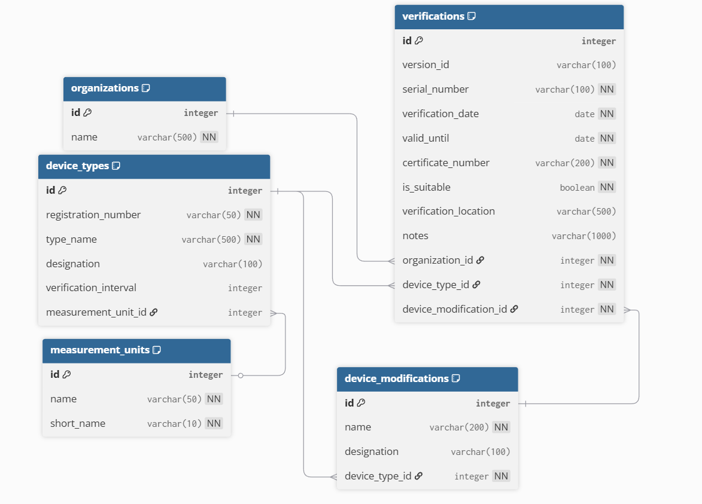

WPF-приложение для хранения и отображения информации о поверке счетчиков из базы данных ФГИС.

Задание на практику:
1. Спроектировать БД PostgreSQL на основании данных с сайта ФГИС
2. Реализовать WPF-приложение для отображения данных
3. Выложить код на GitHub
4. Нарисовать схему БД

Структура проекта:
MeterVerification.App - WPF приложение
MeterVerification.Core - Модели и интерфейсы
MeterVerification.Data - Контекст БД и репозитории

Структура базы данных:
Таблицы:
1. organizations - Организации-поверители
2. device_types - Типы средств измерений
3. device_modifications - Модификации СИ
4. verifications - Записи о поверках (основная таблица)
5. measurement_units - Единицы измерения интервала

Схема БД:

Установка и запуск:
1. Клонирование репозитория
git clone https://github.com/M1Rodem/meter-verification-db-app.git
cd meter-verification-db-app

2. Настройка базы данных PostgreSQL:
1. Настройка подключения к БД
Отредактируйте файл MeterVerification.Data/appsettings.json:

{
  "ConnectionStrings": {
    "DefaultConnection": "Host=localhost;Port=5432;Database=meter_verification_db;Username=ваше имя БД;Password=ваш пароль"
  }
}
и файл DbContextFactory.cs:
var connectionString = "Host=localhost;Port=5432;Database=meter_verification_db;" + "Username=ваше имя БД;Password=ваш пароль";

2. Создание миграций:
Add-Migration InitialCreate
Update-Database

3. Запуск приложения:
1. Откройте решение MeterVerification.sln в Visual Studio
2. Установите проект MeterVerification.App как стартовый
3. Запустить

Технические детали:
Принципы разработки:
- SOLID принципы
- 3 нормальная форма для БД